# Stroom HOWTO - Event Forwarding

## Contents
1. [Introduction](#1-introduction)
1. [Example Event Forwarding - Multipe destinations](#2-example-event-forwarding---multiple-destinations)  
1. [Create Translations](#3-create-translations)
1. [Create Pipeline](#4-create-pipeline)
1. [Test Pipeline](#5-test-pipeline)
    1. [Enabling Processors for Multi Forwarding Pipeline](#51-enabling-processors-for-multi-forwarding-pipeline)
    1. [Examine Output Files on Destination Node](#52-examine-output-files-on-destination-node)

### Document Properties

* Version Information: Created with Stroom v6.1-beta.16  
* Last Updated: 15 August 2021  
* See also: [HOWTO - Apache HTTPD Event Feed](../EventFeeds/CreateApacheHTTPDEventFeed.md)


## 1. Introduction

In some situations, you will want to automatically extract stored Events in their XML format to forward to the file system. This is achieved via a Pipeline with an appropriate XSLT translation that is used to decide what events are forwarded. Once the Events have been chosen, the Pipeline would need to validate the Events (via a schemaFilter) and then the Events would be passed to an xmlWriter and then onto a file system writer (fileSystemOutputStreamProvider or RollingFileAppender).

## 2. Example Event Forwarding - Multiple destinations

In this example, we will create a pipeline that writes Events to the file system, but to multiple destinations based on the location of the Event Client element.

We will use the EventSource/Client/Location/Country element to decided where to store the events. Specifically, we store events from clients in AUS in one location, and events from clients in GBR to another. All other client locations will be ignored.

## 3. Create translations

First, we will create two translations - one for each country location Australia (AUS) and Great Britain (GBR). The AUS selection translation is

``` xml

<?xml version="1.0" encoding="UTF-8" ?>
<xsl:stylesheet version="3.0" xmlns:xsl="http://www.w3.org/1999/XSL/Transform" xmlns="event-logging:3" xmlns:stroom="stroom" xpath-default-namespace="event-logging:3 xmlns:xsi="http://www.w3.org/2001/XMLSchema-instance" xmlns:xs="http://www.w3.org/2001/XMLSchema"> 

<!--
ClientAUS Translation: CHANGE  HISTORY
v1.0.0 - 2015-01-19  
v1.5.0 - 2020-04-15

This translation find all  events  where the  EventSource/Client/Location/Country  element contains the string  'AUS' and then copies them.

-->

<!--  Match all  events -->
<xsl:template  match="/Events|/Events/@*">
<xsl:copy>
<xsl:apply-templates  select="node()|@*" />
</xsl:copy>
</xsl:template>

<!-- Find all  events  whose Client location is in the AUS -->
<xsl:template  match="Event">
<xsl:apply-templates select="EventSource/Client/Location/Country[contains(upper-case(text()),  'AUS')]" />
</xsl:template>

<!--  Country template - deep copy the event -->
<xsl:template  match="Country">
<xsl:copy-of select="ancestor::Event"  />
</xsl:template>
</xsl:stylesheet>

```

The Great Britain selection translation is

``` xml

<?xml version="1.0" encoding="UTF-8" ?>
<xsl:stylesheet version="3.0" xmlns:xsl="http://www.w3.org/1999/XSL/Transform" xmlns="event-logging:3" xmlns:stroom="stroom" xpath-default-namespace="event-logging:3 xmlns:xsi="http://www.w3.org/2001/XMLSchema-instance" xmlns:xs="http://www.w3.org/2001/XMLSchema"> 

<!--
ClientGBR Translation: CHANGE  HISTORY
v1.0.0 - 2015-01-19  
v1.5.0 - 2020-04-15

This translation find all  events  where the  EventSource/Client/Location/Country  element contains the string  'GBR' and then copies them.

-->

<!--  Match all  events -->
<xsl:template  match="/Events|/Events/@*">
<xsl:copy>
<xsl:apply-templates  select="node()|@*" />
</xsl:copy>
</xsl:template>

<!-- Find all  events  whose Client location is in the GBR -->
<xsl:template  match="Event">
<xsl:apply-templates select="EventSource/Client/Location/Country[contains(upper-case(text()),  'GBR')]" />
</xsl:template>

<!--  Country template - deep copy the event -->
<xsl:template  match="Country">
<xsl:copy-of select="ancestor::Event"  />
</xsl:template>
</xsl:stylesheet>
```
We will store this capability in the Explorer Folder **MultiGeoForwarding**. Create two new XSLT under this folder, one called **ClientAUS** and one called **ClientGBR**. Copy and paste the relevant XSL from the above code blocks into its comparable XSLT windows. Save the XSLT by clicking on the  icon. Having created the two translations we see


## 4. Create Pipeline

We now create a Pipeline called **MultiGeoFwd** in the Explorer tree. Within the _MultiGeoForwarding_ folder right click to bring up the object context menu and sub-menu then create a New
Pipeline called **MultiGeoFwd**. The Explorer should now look like


Clicking on the Pipeline **Settings** sub-item and add an appropriate description


Now switch to the **Structure** sub-item and select the source element 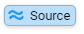Next click on the _Add New Pipeline Element_ icon  

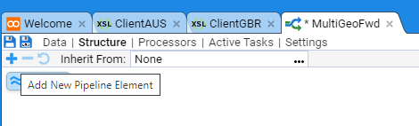

Select _Parser, XMLParser_ from the Element context menu


Click on **OK** in the _Create Element_ dialog box to accept the default for the parser Id.

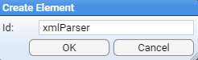

We continue building the pipeline structure by sequentially selecting the last Element and adding the next required Element. We next add a _SplitFilter_ Element

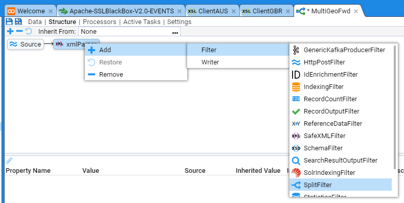

We change the SplitFilter **Id:** from _splitFilter_ to _multiGeoSplitFilter_ and click on **OK** to add the Element to the Pipeline


Our Pipeline currently looks like


We now add the two XSLT translation elements, ClientAUS and ClientGBR to the split Filter. Left click on the split Filter   then left click on the Add New Pipeline Element   to bring up the pipeline Element context menu and select the   XSLTFilter item 

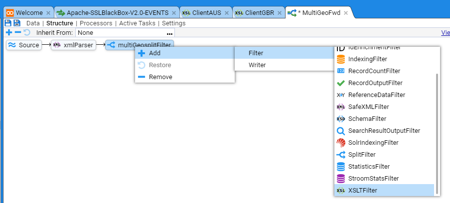

and change the **Id:** from _xsltFilter_ to _ClientAUSxsltFilter_

Now select the multiGeoSplitFilter Element again and add another XSLTFilter as previously

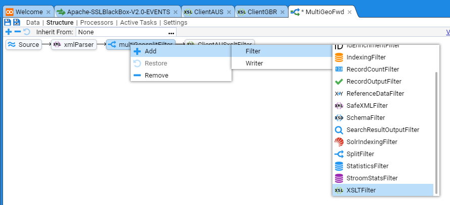

Name this xsltFilter _ClientGBRxsltFilter_.

At this stage the Pipeline should look like


To continue building the Pipeline Structure.
Left click the 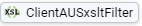 ClientAUSxsltFilter element then left click on the _Add New Pipeline Element_  to bring up the pipeline Element context menu and select the SchemaFilter item 


and change the **Id:** from schemaFilter to AUSschemaFilter to show


Now, left click the AUSschemaFilter element then then right click on the _Add New Pipeline Element_  to bring up the pipeline Element context menu and select the   XMLWriter item 


and change the **Id:** from xmlWriter to AUSxmlWriter


Your Pipeline should now look like


Finally, left click the  AUSxmlWriter element then then right click on the Add New Pipeline Element  _Add New Pipeline Element_   to bring up the **Destination** pipeline Element context menu. Select **RollingFileAppender**


and change the **Id:** from rollingFileAppender to AUSrollingFileAppender to show


This completes the pipeline structure for the AUS branch of the pipeline.  Replicate the process of adding schemaFilter, xmlWriter, and rollingFileAppender Elements for the GBR branch of the pipeline to get the complete pipeline structure as below


Save your Pipeline development work by clicking on the  icon at the top left of the MultiGeoFwd pipeline tab.

We will now assign appropriate properties to each of the pipeline’s elements. First, the client xsltFilters. Click the ClientAUSxsltFilter element to show


In the middle pane click on the _xslt_ **Property Name** line. Now click on the **Edit Property** icon


This will bring up the **Edit Property** selection window


Select the **Value:** to be the ClientAUS translation.


Click on **OK** twice to get your back to main MultiGeoFwd tab which should now have an updated _middle pane_ that looks like


Now go back to the top pane of the Pipeline Structure and select the AUSschemaFilter element on the pipeline. Then click the _schemaGroup_ **Property Name** line. Now click on the **Edit Property** icon. Set the Property Value to be EVENTS


then press **OK**.

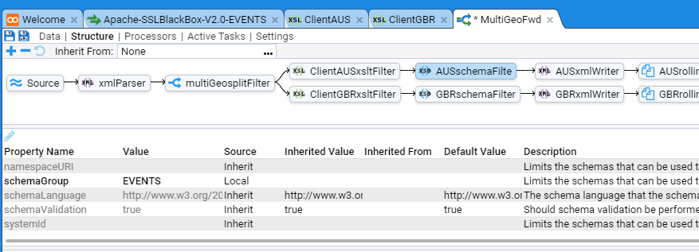

Now select the AUSxmlWriter element in the pipeline structure and click the _indentOutput_ **Property Name** line. Click on the **Edit Property** icon. Set the Property Value to be _true_. The completed Element should look like


Next, select the 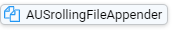 AUSrollingFileAppender and change the Properties as per

* fileName to be fwd_${ms}.lock
* frequency to be 15m
* outputPaths to be /stroom/volumes/defaultStreamVolume/forwarding/AUS00
* rolledFileName to be fwd_${ms}.ready

Note that these settings are for demonstration purposes only and will depend on your unique Stroom instance's configuration. The outputPath can contain replacement variables to provide more structure if desired. [File Output substitution variables](https://gchq.github.io/stroom-docs/user-guide/pipelines/file-output.html)


Repeat this Element Property Name assignment for the GBR branch of the pipeline substituting the ClientGBR translation and /stroom/volumes/defaultStreamVolume/forwarding/GBR00  for rollingFileAppender outputPaths where appropriate.

Note, if you expect lots of events to be processed by the pipeline, you may which to create multiple outputPaths. For example, you could have

/stroom/volumes/defaultStreamVolume/forwarding/_AUS00_,  /stroom/volumes/defaultStreamVolume/forwarding/_AUS01_,
/stroom/volumes/defaultStreamVolume/forwarding/_AUS0n_


and 

/stroom/volumes/defaultStreamVolume/forwarding/_GBR00_,
/stroom/volumes/defaultStreamVolume/forwarding/_GBR01_,
/stroom/volumes/defaultStreamVolume/forwarding/_GBR0n_

as appropriate. 

Save the pipeline by pressing the Save  icon.

## 5. Test Pipeline

We first select a stream of Events which we know to have both AUS and GBR Client locations. We have such a stream from our Apache-SSLBlackBox-V2.0-EVENTS Feed.


We select the Events stream and Enter Stepping Mode by pressing the   button in the bottom right


and we will choose the  to step with.

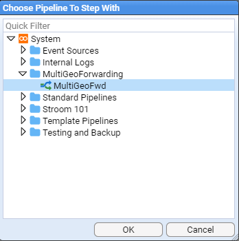

We are now presented with the _Stepping_ tab positioned at the start 

If we step forward by clicking on the  icon we will see that our first event in our source stream has a Client Country location of USA.


If we now click on the  element we will see the ClientAUS translation in the code pane. The first Event in the _input_ pane and an empty event in the _output_ pane. The output is empty as the Client/Location/Country is NOT the string _AUS_, which is what the translation is matching on.

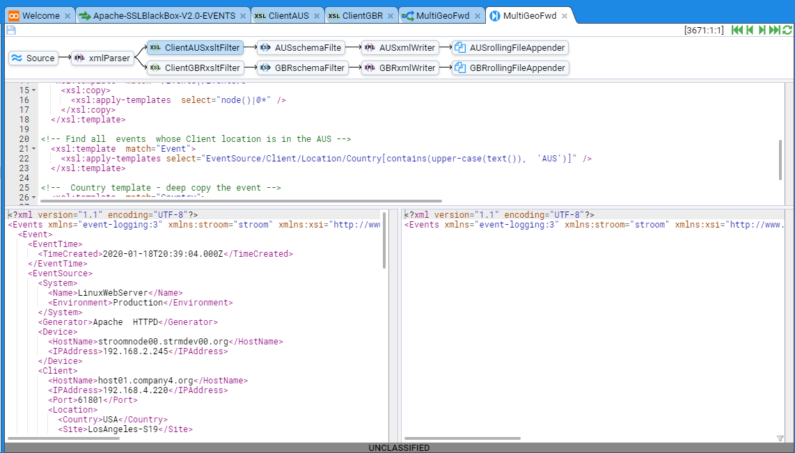

If we step forward to the 5th Event we will see the _output_ pane change and become populated. This is because this Event's Client/Location/Country value is the string _AUS_.


Note, that you can move to the 5th Event on the pipeline by clicking on the  icon repeatedly until you get to the 5th event, or you can insert your cursor into the **recordNo** of the stepping key to manually change the recordNo from 1 to 5
 and then press **Enter**. This jumps the stepping process to the RecordNo you specify, in this particular case "5". 

If you repeatedly click on the  icon seven more times you will continue to see Events in the _output_ pane, as our stream source Client/Location/Country value is _AUS_ for Events 5-11.

Now, double click on the    element. The _output_ pane will once again be empty as the Client/Location/Country value of this Event (AUS) does not match what your translation is filtering on (GBR).

If you now step forward 1 event using the  icon, you will see the ClientGBR translation _output_ pane populate as Events 12-16 have a Client/Location/Country of GRC.


We have thus tested the ‘splitting’ effect of our pipeline. We now need to turn it on and produce files.

### 5.1. Enabling Processors for Multi Forwarding Pipeline

To enable the Processors for the pipeline, select the _MultiGeoFwd_ pipeline tab and then select the Processors sub-item.


For testing purposes, we will only apply this pipeline to our Apache-SSLBlackBox-V2.0-EVENTS feed to minimise the test output files. 

To create the Processor, click the Add Processor   icon to bring up the _Add Processor_ selection window. 

Add the following items to the processor:
* Feed is Apache-SSLBlackBox-V2.0-EVENTS
* Type = Events

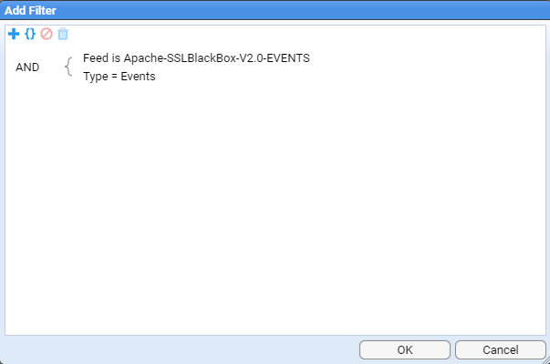

then press **OK** to see


Enable the processors by checking both Enabled check boxes

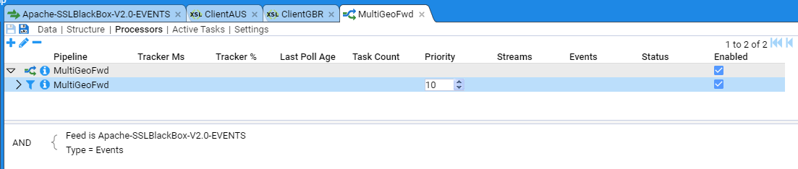

If we switch to the Active Tasks tab of the MultiGeoFwd pipeline, a refresh of the panes  will show that we have passed streams from the
APACHE-SSLBlackBox-V2.0-EVENTS feed to completion. If we select the MultiGeoFwd pipeline in the top pane we will see each stream that has run.

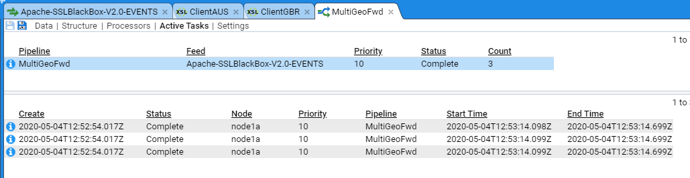

Take note that all streams have processed on Node node1a. 

### 5.2. Examine Output Files on Destination Node

If we navigate to the /stroom/volumes/defaultStreamVolume/forwarding directory on the processing node we should be able to view the expected output files.

``` bash
[testdoc@localhost defaultStreamVolume]# cd forwarding
[testdoc@localhost forwarding]# ls -lR
.:
total 0
drwxr-xr-x. 2 testdoc testdoc 129 May  5 01:13 AUS00
drwxr-xr-x. 2 testdoc testdoc 129 May  5 01:13 GBR00

./AUS00:
total 136
-rw-r--r--. 1 testdoc testdoc 21702 May  4 22:28 fwd_1588588112856.ready
-rw-r--r--. 1 testdoc testdoc 21702 May  4 22:44 fwd_1588589043294.ready
-rw-r--r--. 1 testdoc testdoc 64452 May  5 01:09 fwd_1588597744865.ready
-rw-r--r--. 1 testdoc testdoc 21692 May  5 01:14 fwd_1588598005439.lock

./GBR00:
total 96
-rw-r--r--. 1 testdoc testdoc 15660 May  4 22:28 fwd_1588588112809.ready
-rw-r--r--. 1 testdoc testdoc 15660 May  4 22:44 fwd_1588589043293.ready
-rw-r--r--. 1 testdoc testdoc 46326 May  5 01:09 fwd_1588597744865.ready
-rw-r--r--. 1 testdoc testdoc 15650 May  5 01:14 fwd_1588598005408.lock
[testdoc@localhost forwarding]#
```
The output directory contains files with suffixes of  *.lock or *.ready. All the files that are ‘currently processing’ have a nomenclature of *.lock suffix. These are the files that our pipeline is currently writing to. Remember we configured the rollingFileAppender to roll the files at a frequency of 15 minutes. We may need to wait up to 15 minutes before a file move from .lock to .ready status.

If we check one of the AUS00 output files we see the expected result

``` xml
[testdoc@localhost forwarding]# less AUS00/fwd_1588588112856.ready
<?xml version="1.1" encoding="UTF-8"?>
<Events xmlns="event-logging:3"
        xmlns:stroom="stroom"
        xmlns:xsi="http://www.w3.org/2001/XMLSchema-instance"
        xmlns:xs="http://www.w3.org/2001/XMLSchema"
        xsi:schemaLocation="event-logging:3 file://event-logging-v3.2.3.xsd"
        Version="3.2.3">
   <Event>
      <EventTime>
         <TimeCreated>2020-01-18T22:43:04.000Z</TimeCreated>
      </EventTime>
      <EventSource>
         <System>
            <Name>LinuxWebServer</Name>
            <Environment>Production</Environment>
         </System>
         <Generator>Apache  HTTPD</Generator>
         <Device>
            <HostName>stroomnode00.strmdev00.org</HostName>
            <IPAddress>192.168.2.245</IPAddress>
         </Device>
         <Client>
            <HostName>host32.strmdev01.org</HostName>
            <IPAddress>192.168.8.151</IPAddress>
            <Port>62015</Port>
            <Location>
               <Country>AUS</Country>
               <Site>Sydney-S02</Site>
               <Building>RC45</Building>
               <Room>5-134</Room>
               <TimeZone>+10:00/+11:00</TimeZone>
            </Location>
         </Client>

         ....

AUS00/fwd_1588588112856.ready
```

Similarly, if we look at one of the GBR00 output files we also see the expected output

``` xml
[testdoc@localhost forwarding]# less GBR00/fwd_1588588112809.ready
<?xml version="1.1" encoding="UTF-8"?>
<Events xmlns="event-logging:3"
        xmlns:stroom="stroom"
        xmlns:xsi="http://www.w3.org/2001/XMLSchema-instance"
        xmlns:xs="http://www.w3.org/2001/XMLSchema"
        xsi:schemaLocation="event-logging:3 file://event-logging-v3.2.3.xsd"
        Version="3.2.3">
   <Event>
      <EventTime>
         <TimeCreated>2020-01-18T12:50:06.000Z</TimeCreated>
      </EventTime>
      <EventSource>
         <System>
            <Name>LinuxWebServer</Name>
            <Environment>Production</Environment>
         </System>
         <Generator>Apache  HTTPD</Generator>
         <Device>
            <HostName>stroomnode00.strmdev00.org</HostName>
            <IPAddress>192.168.2.245</IPAddress>
         </Device>
         <Client>
            <HostName>host14.strmdev00.org</HostName>
            <IPAddress>192.168.234.9</IPAddress>
            <Port>62429</Port>
            <Location>
               <Country>GBR</Country>
               <Site>Bristol-S22</Site>
               <Building>CAMP2</Building>
               <Room>Rm67</Room>
               <TimeZone>+00:00/+01:00</TimeZone>
            </Location>
         </Client>

        ....

GBR00/fwd_1588588112809.ready
```

At this point, you can manage the .ready files in any manner you see fit.