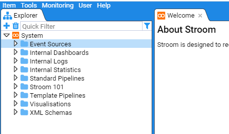
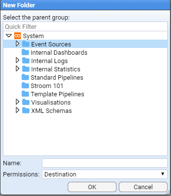
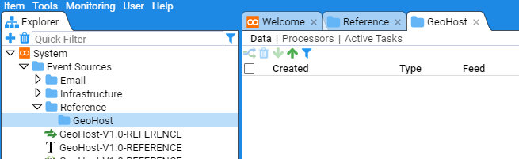
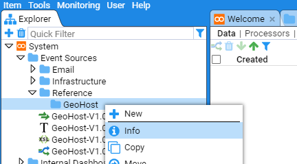
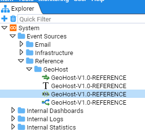

# Stroom HOWTO - Explorer Management

### Document Properties

* Version Information: Created with Stroom v6.1-beta.16   
* Last Updated: 15 August 2021  

## Moving a set of Objects

The following shows how to create a System Folder(s) within the Explorer tree and move a set of objects into the new structure. We will create the system group GeoHost Reference and move all the GeoHost reference feed objects into this system group.
Because Stroom Explorer is a flat structure you can move resources around to reorganise the content without any impact on directory paths, configurations etc.

### Create a System Group

First, move your mouse over the `Event Sources` object in the explorer, single click to highlight this object to highlight, you will see

Now right click to bring up the object context menu

Next move the mouse over the   New icon to reveal the New sub-context menu.

Click on the  icon, at which point the _New Folder_ selection window will be presented

We will enter the name _Reference_ into the **Name:** entry box

With the newly created `Reference` folder highlighted, repeat the above process but use the folder **Name:** of GeoHost

then click _OK_ to save.

Note that we could have navigated within the explorer tree but as we want the Reference/GeoHost system group at the top level of the `Event Sources` group, there is no need to perform any navigation. Had we needed to, double click any system group that contains objects, indicated by the   icon and to select the system group you want to store your new group in, just left or right click the mouse once over the group to select it. You will note that the `Event Sources` system group was selected above.

At this point, our new folders will display in the main pane.

You can look at the folder properties by selecting the desired folder, right clicking and choosing *Info* option

This will return a window with folder specific information

Should you wish to limit the users who can access this folder, you similarly select the desired folder, right click and choose *Permissions*

You can limit folder access as required in the resultant window. 

Make any required changes and click on **OK** to save the changes.

### Moving Objects into a System Group

Now you have created the new folder structure you can move the various GeoHost resources to this location.

Select all four resources by using the mouse right-click button while holding down the _Shift_ key. Then right click on the highlighted group to display the action menu

Select **move** and the _Move Multiple Items_ window will display. Navigate to the `Reference/GeoHost` folder to move the items to this destination.

The final structure is seen below

Note that when a folder contains child objects this is indicated by a folder icon with an arrow to the left of the folder . Whether the arrow is pointing right or down indicates whether or not the folder is expanded.

The GeoHost resources move has now been completed.