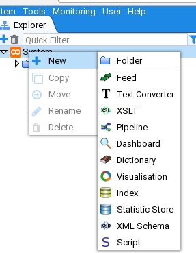
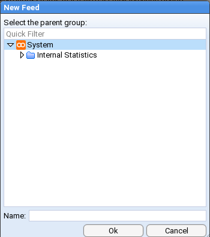

# Stroom HOWTO - Feed Management
This HOWTO demonstrates how to manage
[Feeds](../../user-guide/feeds.md "Stroom Feeds")

## Assumptions
- All Sections
 - an account with the `Administrator` Application [Permission](../../user-guide/roles.md "Stroom Application Permissions") is currently logged in.

### Creation of an Event Feed
We will be creating an Event Feed with the name `TEST-FEED-V1_0`.

Once you have logged in, move the cursor to the **System** directory with the `Explorer` tab and select it.

Once selected, _right click_ to bring up the `New Item` selection sub-menu. By selecting the **System** directory we are
requesting any  _new_ item created to be placed within in.

Now move the cursor to the _Feed_ sub-item

and select it. You will be presented with a `New Feed` configuration window.

You will note that the **System** directory has already been selected as the _parent group_ and all we need to do is enter our feed's name in the **Name:** entry box

On pressing

we are presented with the `Feed` tab for our new feed. The tab is labelled with the feed name `TEST-FEED-V1_0`.

.

We will leave the definitions of the Feed attributes for the present, but we _will_ enter a **Description:** for our feed
as we should _ALWAYS_ do this fundamental tenet of data management - document the data. We will use
the description of '_Feed for installation validation only. No data value_'.

.

One should note that the `Feed` tab as been marked as having unsaved changes. This is indicated by the asterisk
character `*` between the _Feed_ icon  and the name of the feed `TEST-FEED-V1_0`.
We can save the changes to our feed by pressing the _Save_ icon  in
the top left of the `TEST-FEED-V1_0` tab. At this point one should notice two things, the first is that the asterisk
has disappeared from the `Feed` tab and the _Save_ icon  is _ghosted_.

.

