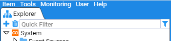

# **Stroom HOWTO - Use a Reference Feed**

Reference feeds are temporal stores of reference data that a translation can look up to enhance an Event with additional data. For example, rather than storing a person’s full name and phone number in every event, we can just store their user id and, based on this value, look up the associated user data and decorate the event.
In the description below, we will make use of the GEOHOST-REFERENCE reference feed defined in another HOWTO document. 

Author: John Doe
Last Updated: 27 Feb 2020
Recommended Additional Documentation:
HOWTO - Creating a Simple Reference Feed

## **Using a Reference Feed**

To use a Reference Feed, one uses the Stroom xslt function stroom:lookup(). This function is found within the xml namespace xmlns:stroom="stroom".

The lookup function has two mandatory arguments and two optional as per

lookup(String map, String key) 	Look up a reference data map using the period start time
lookup(String map, String key, String time) 	Look up a reference data map using a specified time, e.g. the event time
 
lookup(String map, String key, String time, Boolean ignoreWarnings)
 
Look up a reference data map using a specified time, e.g. the event time, and ignore any warnings generated by a failed lookup
 

Lets say, we have the Event fragment

<Event>
<EventTime>
<TimeCreated>2020-01-11T05:48:28.000Z</TimeCreated>
</EventTime>
<EventSource>
<System>
<Name>WebSite</Name>
<Environment>Production</Environment>
</System>
<Generator>Apache  HTTPD</Generator>
<Device/>
<Client>
<IPAddress>192.168.4.220</IPAddress>
<Port>60771</Port>
</Client>
<Server>
<HostName>host01.company4.org</HostName>
<Port>443</Port>
</Server>
...
</EventSource>

then the following XSLT would lookup our GEOHOST Reference map to find the FQDN of our client

<xsl:variable name="chost" select="stroom:lookup('IP_TO_FQDN',  Event/EventSource/Client/IPAddress)" />

And the XSLT to find the IP Address for our Server would be

<xsl:variable name="sip" select="stroom:lookup('FQDN_TO_IP',  Event/EventSource/Server/HostName)"  />

In practice, one would also pass the element as well as setting ignoreWarnings to true(). i.e.

<xsl:variable name="chost" select="stroom:lookup('IP_TO_FQDN',  Event/EventSource/Client/IPAddress, Event/EventTime/TimeCreated, true())"  />
...
<xsl:variable name="sip" select="stroom:lookup('FQDN_TO_IP',  Event/EventSource/Client/IPAddress, Event/EventTime/TimeCreated, true())"  />

## **Modifying an Event feed to use a Reference Feed**

We will now modify an Event feed to have it lookup our GEOHOST reference maps to add additional information to the event. The feed for this exercise is the Apache-SSL-BlackBox-V2.0-EVENTS event feed which processes Apache HTTPD SSL logs which make use of a variation on the BlackBox log format. We will step through a Raw Event stream and modify the translation directly. This way, we see the changes directly.

Using the Explorer pane’s _Quick Filter_, entry box, we will find the Apache feed. 

First, select the _Quick Filter_ text entry box and type Apache (the Quick Filter is case insensitive). At this you will see the Explorer pane system group structure reduce down to just the `Event Sources`.

The Explorer pane will display any resources that match our `Apache` string. 
Double clicking on the  feed will select it, and bring up the Feed’s tab in the main window.

