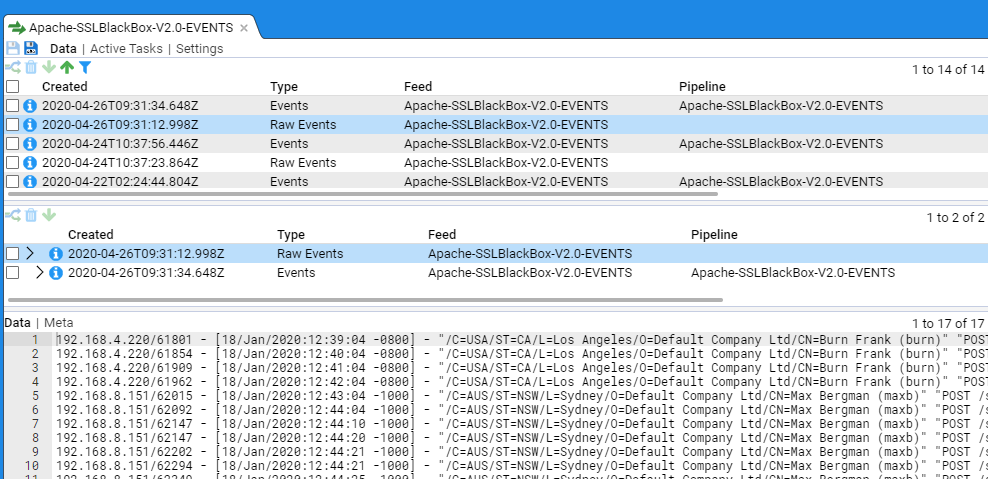
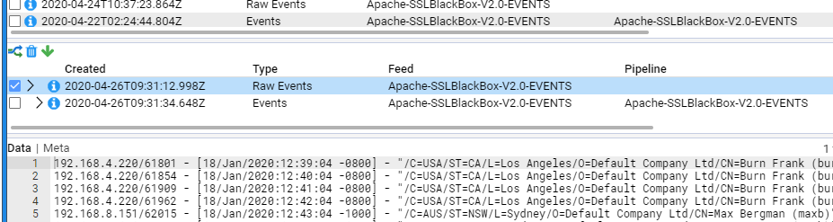
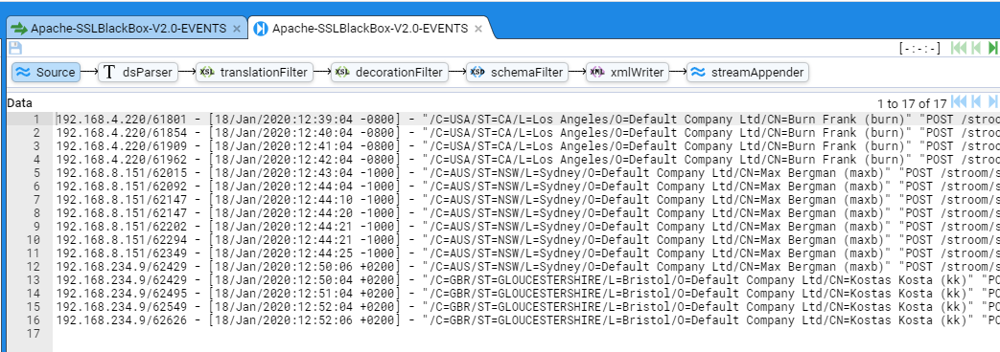
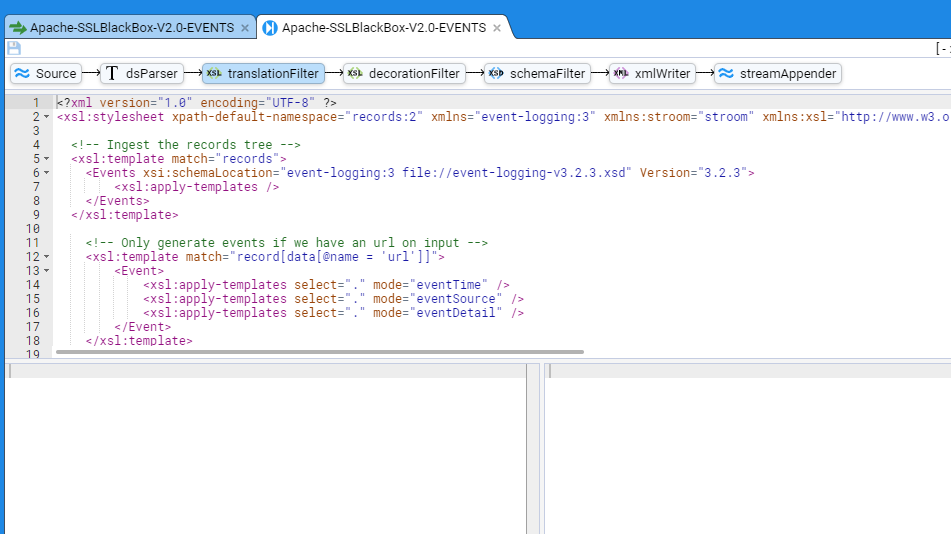
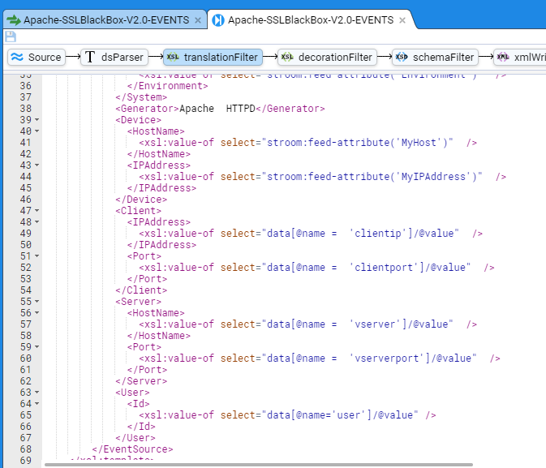
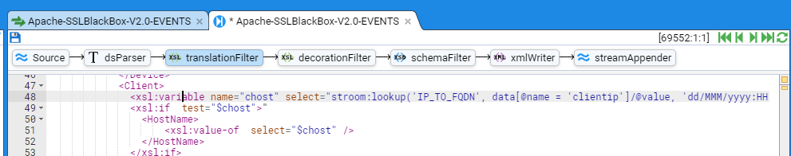
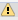
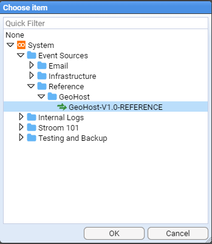

# Stroom HOWTO - Use a Reference Feed

## Contents
1. [Introduction](#1-introduction)
1. [Using a Reference Feed](#2-using-a-reference-feed)    
1. [Modifying an Event Feed to use a Reference Feed](#3-modifying-an-event-feed-to-use-a-reference-feed)
1. [Troubleshooting lookup issues](#4-troubleshooting-lookup-issues)

## 1. Introduction
Reference feeds are temporal stores of reference data that a translation can look up to enhance an Event with additional data. For example, rather than storing a person’s full name and phone number in every event, we can just store their user id and, based on this value, look up the associated user data and decorate the event.
In the description below, we will make use of the `GeoHost-V1.0-REFERENCE` reference feed defined in separate HOWTO document. 

### Document Properties

* Version Information: Created with Stroom v6.1-beta.16  
* Last Updated: 15 August 2021  
* See also: [HOWTO - Creating a Simple Reference Feed](../ReferenceFeeds/CreateSimpleReferenceFeed.md)


## 2. Using a Reference Feed

To use a Reference Feed, one uses the Stroom xslt function stroom:lookup(). This function is found within the xml namespace xmlns:stroom="stroom".

The lookup function has two mandatory arguments and three optional as per

* _lookup(String map, String key)_ Look up a reference data map using the period start time
* _lookup(String map, String key, String time)_ Look up a reference data map using a specified time, e.g. the event time
* _lookup(String map, String key, String time, Boolean ignoreWarnings)_ Look up a reference data map using a specified time, e.g. the event time, and ignore any warnings generated by a failed lookup
* _lookup(String map, String key, String time, Boolean ignoreWarnings, Boolean trace)_ Look up a reference data map using a specified time, e.g. the event time, ignore any warnings generated by a failed lookup and get trace information for the path taken to resolve the lookup.
 

Let's say, we have the Event fragment

```xml
<Event>
    <EventTime>
      <TimeCreated>2020-01-18T20:39:04.000Z</TimeCreated>
    </EventTime>
    <EventSource>
      <System>
        <Name>LinuxWebServer</Name>
        <Environment>Production</Environment>
      </System>
      <Generator>Apache  HTTPD</Generator>
      <Device>
        <HostName>stroomnode00.strmdev00.org</HostName>
        <IPAddress>192.168.2.245</IPAddress>
      </Device>
      <Client>
        <IPAddress>192.168.4.220</IPAddress>
        <Port>61801</Port>
      </Client>
      <Server>
        <HostName>stroomnode00.strmdev00.org</HostName>
        <Port>443</Port>
      </Server>
    ...
    </EventSource>
```

then the following XSLT would lookup our `GeoHost-V1.0-REFERENCE` Reference map to find the FQDN of our client

```xml 
<xsl:variable name="chost" select="stroom:lookup('IP_TO_FQDN', data[@name = 'clientip']/@value)" /> 
```

And the XSLT to find the IP Address for our Server would be

``` xml
<xsl:variable name="sipaddr" select="stroom:lookup('FQDN_TO_IP', data[@name = 'vserver']/@value)"  />
```

In practice, one would also pass the time element as well as setting ignoreWarnings to true(). i.e.

``` xml
<xsl:variable name="chost" select="stroom:lookup('IP_TO_FQDN', data[@name = 'clientip']/@value, $formattedDate, true())"  />
...
<xsl:variable name="sipaddr" select="stroom:lookup('FQDN_TO_IP',  data[@name = 'vserver']/@value, $formattedDate, true())"  />
```

## 3. Modifying an Event Feed to use a Reference Feed

We will now modify an Event feed to have it lookup our `GeoHost-V1.0-REFERENCE` reference maps to add additional information to the event. The feed for this exercise is the `Apache-SSL-BlackBox-V2.0-EVENTS` event feed which processes Apache HTTPD SSL logs which make use of a variation on the BlackBox log format. We will step through a Raw Event stream and modify the translation directly. This way, we see the changes directly.

Using the Explorer pane’s _Quick Filter_, entry box, we will find the Apache feed. 


First, select the _Quick Filter_ text entry box and type Apache (the Quick Filter is case insensitive). At this you will see the Explorer pane system group structure reduce down to just the `Event Sources`.


The Explorer pane will display any resources that match our `Apache` string. 
Double clicking on the  feed will select it, and bring up the Feed’s tab in the main window.


We click on the tab’s Data sub-item and then select the most recent Raw Events stream.



Now, select the check box on the Raw Events stream in the Specific Stream (middle) pane.



Note that, when we check the box, we see that the Process, Delete and Download  icons are enabled.

We enter Stepping Mode by pressing the stepping button found at the bottom right corner of the Data/Meta-data pane. You will then be requested to choose a pipeline to step with, with the selection already pre-selected


This auto pre-selection is a simple pattern matching action by Stroom. Press **OK** to start the stepping which displays the pipeline stepping tab



Select the  button to reveal the translation we plan to modify.



To bring up the first event from the stream, press the Step Forward button  to show


We scroll the translation pane to show the XSLT segment that deals with the <Client> and <Server> elements



and also scroll the translation output pane to display the <Client> and <Server> elements


We modify the Client xslt segment to change

``` xml
    <Client>
        <IPAddress>
            <xsl:value-of select="data[@name =  'clientip']/@value"  />
        </IPAddress>
        <Port>
            <xsl:value-of select="data[@name =  'clientport']/@value"  />
        </Port>
    </Client>
```

to

``` xml
    <Client>
        <xsl:variable name="chost" select="stroom:lookup('IP_TO_FQDN', data[@name = 'clientip']/@value)" />
        <xsl:if  test="$chost">"
            <HostName>
                <xsl:value-of  select="$chost" />
            </HostName>
        </xsl:if>
            <IPAddress>
                <xsl:value-of select="data[@name =  'clientip']/@value"  />
            </IPAddress>
        <xsl:if test="data[@name =  'clientport']/@value !='-'">
            <Port>
                <xsl:value-of select="data[@name =  'clientport']/@value"  />
            </Port>
        </xsl:if>
    </Client>
```

and then we press the Refresh Current Step   icon 

BUT NOTHING CHANGES !!!

Not quite, you will note in the top right of the translation pane some **yellow** boxes.



If you click on the top square box, you will see the WARN: 1 selection window


Clicking on the yellow rectangle box below the yellow square box, the translation pane will automatically scroll back to the top of the translation and show the   icon


Clicking on the   icon will reveal the actual warning message


The problem is that, the pipeline cannot find the Reference. To allow a pipeline to find reference feeds, we need to modify the translation parameters within the pipeline. The pipeline for this Event feed is called `APACHE-SSLBlack-Box-V2.0-EVENTS`. Open this pipeline by double clicking on its entry in the Explorer window


then switch to the **Structure** sub-item


and then select the   icon to reveal


The top pane shows the pipeline, in this case, the selected translation filter   element of the pipeline. The middle pane shows the _Properties_ for this element - we see that it has an **xslt** property of the `APACHE-BlackBoxV2.0-EVENTS` translation. The bottom pane is the one we are interested in. In the case of translation Filters, this pane allows one to associate Reference streams with the translation Filter.


So, to associate our `GeoHost-V1.0-REFERENCE` reference feed with this translation filter, click on the   New  Reference icon to bring up the _New Pipeline Reference_ selection window


For **Pipeline:** use the menu selector   and choose the Reference  Loader pipeline and then press **OK**

 

 For **Feed:**, navigate to the reference feed we want, that is the `GeoHost-V1.0-REFERENCE` reference feed and press **OK**



And finally, for **Stream Type:** choose Reference from the drop-down menu


then press **OK** to save the new reference. We now see


Save these pipeline changes by pressing the    icon in the top left then switch back to the APACHE-SSLBlackBox-V2.0-EVENTS stepping tab.

Pressing the Refresh Current Step   icon will remove the warning and we now note that the output pane now shows the ```<Client/HostName> ```element.


To complete the translation, we will add reference lookups for the ```<Server/HostName>``` element and we will also add ```<Location>``` elements to both the ```<Client>``` and ```<Server>``` elements.

The completed code segment looks like

``` xml
    ...

    <!-- Set some variables to enable lookup functionality  -->
    <xsl:variable name="formattedDate" select="stroom:format-date(data[@name =  'time']/@value, 'dd/MMM/yyyy:HH:mm:ss XX')" />

    <!--  For Version 2.0 of Apache  audit we  have the virtual  server,  so this  will be our server -->
    <xsl:variable name="vServer" select="data[@name  =  'vserver']/@value"  />
    <xsl:variable name="vServerPort" select="data[@name =  'vserverport']/@value"  />

    ...
 
    <!-- -->
    <Client>
    <!--  See if we  can get the client  HostName from  the given IP address -->
    <xsl:variable name="chost" select="stroom:lookup('IP_TO_FQDN',data[@name  =  'host']/@value, $formattedDate, true())"  />
        <xsl:if  test="$chost">
        <HostName>
            <xsl:value-of  select="$chost" />
        </HostName>
        </xsl:if>
        <IPAddress>
            <xsl:value-of select="data[@name =  'clientip']/@value"  />
        </IPAddress>
        <xsl:if test="data[@name =  'clientport']/@value !='-'">
        <Port>
            <xsl:value-of select="data[@name =  'clientport']/@value"  />
        </Port>
        </xsl:if>

    <!--  See if we  can get the client  Location for the client  FQDN if we  have it -->
    <xsl:variable name="cloc" select="stroom:lookup('FQDN_TO_LOC', $chost,  $formattedDate, true())"  />
        <xsl:if  test="$chost != '' and $cloc">
        <xsl:copy-of select="$cloc"  />
        </xsl:if>
    </Client>

    <!-- -->
    <Server>
        <HostName>
            <xsl:value-of  select="$vServer" />
        </HostName>

    <!--  See if we  can get  the  service  IPAddress -->
    <xsl:variable name="sipaddr" select="stroom:lookup('FQDN_TO_IP',$vServer, $formattedDate,  true())"  />
        <xsl:if  test="$sipaddr">
        <IPAddress>
            <xsl:value-of  select="$sipaddr" />
        </IPAddress>
        </xsl:if>

    <!--  Server Port Number   -->
        <xsl:if test="$vServerPort !='-'">
        <Port>
            <xsl:value-of  select="$vServerPort" />
        </Port>
        </xsl:if>

    <!--  See if we  can get the Server location -->
    <xsl:variable name="sloc"  select="stroom:lookup('FQDN_TO_LOC', $vServer, $formattedDate, true())"  />
        <xsl:if  test="$sloc">
            <xsl:copy-of select="$sloc"  />
        </xsl:if>
    </Server>

```
Once the above modifications have been made to the XSLT, save these by pressing the    icon in the top left corner of the pane.

Note the use of the fourth Boolean ignoreWarnings argument in the lookups. We set this to true() as we may not always have the item in the reference map we want and Warnings consume space in the Stroom store file system.

Thus, the fragment from the output pane for our first event shows


and the fragment from the output pane for our last event of this stream shows


A copy of this XSLT Translation can be found  [here](ApacheHPPTDwithLookups-TranslationXSLT.txt "Apache BlackBox with Lookups Translation XSLT").

## 4. Troubleshooting lookup issues

If your lookup is not working as expected you can use the 5th argument of the lookup function to help investigate the issue.

If we return to the   element of the pipeline and change the xslt from

``` xml
    <Client>
        <xsl:variable name="chost" select="stroom:lookup('IP_TO_FQDN', data[@name = 'clientip']/@value, $formattedDate, true())" />
```

to

``` xml
    <Client>
        <xsl:variable name="chost" select="stroom:lookup('IP_TO_FQDN', data[@name = 'clientip']/@value, $formattedDate, true(), true())" />
```
and then we press the Refresh Current Step   icon 


you will notice the two blue squares at the top right of the code pane 


If you click on the lower blue square then the code screen will reposition to the beginning of the xslt. Note the  icon at the top left of the screen. If you hover over this information icon you will
see information about the path taken to resolve the lookup. Hopefully this additional information guides resolution of the lookup issue.


Once you have completed your troubleshooting you can either remove the 5th argument from the lookup function, or set to false.