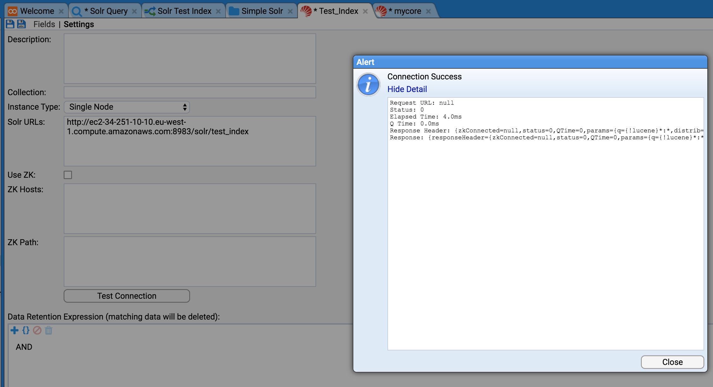
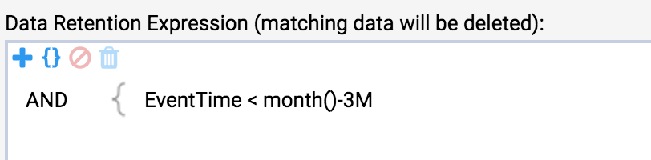

# Using Solr with Stroom

This document will show how to use Solr from within Stroom.
A single Solr node will be used running in a docker container.

## Assumptions
1. You are familiar with Lucene indexing within Stroom
1. You have some data to index

## Points to note
1. A Solr core is the home for exactly one Stroom index.
1. Cores must initially be created in Solr.
1. It is good practice to name your Solr core the same as your Stroom Index.

## Method
1. Start a docker container for a single solr node.
```bash
docker run -d -p 8983:8983 --name my_solr solr
```
1. Check your Solr node. Point your browser at http://yourSolrHost:8983
1. Create a core in Solr using the CLI.
```bash
docker exec -it my_solr solr create_core -c test_index
```
1. Create a SolrIndex in Stroom

1. Update settings for your new Solr Index in Stroom then press "Test Connection".
If successful then press Save
Note the "Solr URL" field is a reference to the newly created Solr core.

1. Add some Index fields.
e.g.EventTime, UserId
1. Retention is different in Solr, you must specify an expression that matches data that can be deleted.

1. Your Solr Index can now be used as per a Stroom Lucene Index.
However, your Indexing pipeline must use a SolrIndexingFilter instead of an IndexingFilter.
