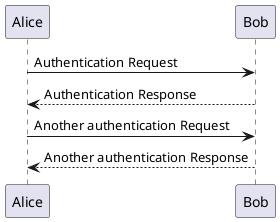

---
title: "Images"
linkTitle: "Images"
weight: 50
description: >
  Examples of how to include images in documents.
# Set draft: true to stop the page appearing in the published/released version.
tags:
  - style
exclude_search: true

---

## Image assets

All Images should be placed in `/assets/images/` or within a descendent directory of it.
Images should be added to the markdown using the `image` shortcode.
This ensures a consistent look for all images and allows control of the size of the image.

The short code can be added in the following ways.

```markdown




Image caption
```

All paths used in the `image` shortcode are relative to `/assets/images`.

The following shows an example of the directory structure.

```text

/assets
   /images
      /section-x
         /sub-section-y
            /page1
               /image.svg
/content
   /en
      /docs
         /section-x
            /sub-section-y
               page1.md - #image shortcode used in here
```

Where images are only used by one page then the directory structure in `/assets` ought to mirror that of the page the images are used in, as shown above.
If images are used by multiple pages then some other sensible organisation of the images should be used, e.g. `/assets/images/section-x` if they are limited to pages in one section, or `/aaets/images/common` if they are used in multiple sections.


### Captions

The image can be displayed with a caption:


By W3C SVG Logo, CC BY-SA 4.0, https://commons.wikimedia.org/w/index.php?curid=105996438



### Size

The image can be defined with a maximum width (e.g. `"300x"`) or a maximum height (`"x200"`).



### .png files

`.png` files can be rendered in their original size by omitting the size argument.



Or they can be rendered with a set size.




## Using global `/assets/` resources

For images that are shared by multiple page bundles, e.g. stroom icons, place them in `/assets/images/`.
The image path is relative to `/assets/images/`, e.g. file  `/assets/images/style-guide/svg-example.svg` becomes:

```markdown

```


This is some optional caption text for the image.
And this is another line.



## PlantUML

[PlantUML](https://plantuml.com) is the favoured tool for producing diagrams such as UML diagrams, entity relationship diagrams and other more general architecture diagrams.
The diagrams are written in plain text which makes them easy to version control.
The plantUML syntax can then be converted into image files, e.g. .svg files.

A plantUML diagram looks like this in plain text form:



PlantUML diagrams should be saved in a dedicated `.puml` file in the same folder as the page that will display it.
If it is needed by multiple pages then it should be saved in `/assets/images/`.

The build process will convert all `.puml` files to a corresponding `.puml.svg` file.
These generated `.puml.svg` files are ignored by git so need to be regenerated at build time or when you change a `.puml` file.
The images can be generated by doing:

```bash
./container_build/runInPumlDocker.sh SVG
```

You should embed an PlantUML image like this, using the `.puml.svg` file (that may not yet exist, but will have to exist before the site is built):




## Using page resources

Images can be located in a [page bundle (external link)](https://gohugo.io/content-management/page-bundles/).
This is where the page is defined as a named directory (rather than a `.md` file) with an associated `index.md` file for the markdown contnet.
All other items in the directory are page resources that can be used by the page, i.e. image files.

{}
Whilst you can structure your site using page resources the preffered approach for stroom-docs is to use the common assets directory.
This keeps all the images in one place and means pages can have a named markdown file rather than all being called `index.md`.
{}

Use the `image` short code to display an image file that is located in the same directory as the page.
For the short code to work the page must be a leaf bundle (`index.md`) or a branch bundle (`_index.md`), i.e:

```text
/docs
   /MyPage
      index.md - #image shortcode used in here
      example.svg
```

or 

```text
/docs
   /MySection
      /Page1
         index.md
      /Page2
         index.md
      _index.md - #image shortcode used in here
      example.svg
```

In the above example, the shortcode would look like:

```markdown

```




## Stroom user interface Components

Sometimes it is useful to display an image of certain user interface elements to explain something.
Rather than use screenshots which are very difficult to keep up to date, you can instead use some simple shortcodes to display some UI elements, e.g. buttons, pipeline elements, etc.
By using shortcodes, any change to the look of the Stroom UI means only the shortcode content and their styling need to change, without having to recreate tens or hundreds of screenshots.


### Stroom icons

Stroom UI icons such as  or  can be added in line using the shortcode `stroom-icon`.

**Arguments**:
* `icon_file_path` - The filename (and path) of the icon file.
  The path is relative to `/assets/images/stroom-ui/`.
* `title` (optional) - The hover tip title that will be given to the icon.
* `state` (optional) [`enabled`|`disabled`] - Whether the button is enabled or disabled.
  Defaults to enabled.

The full list of available icons can be found in the [Icon Gallery]().

{}
The icon filenames and paths are case sensitive so ensure you have the correct case, e.g. most `document` icons are in upper sentence case.
Also note the extension of the icon files as most are `.svg` but some are `.png`.
{}

E.g:


  
Simple use: 
Custom name: 
Disabled document icon: 

  
  
```markdown
Simple use: 
Custom name: 
Disabled document icon: 
```
  



### Buttons

To display a UI button you can use the shortcode `stroom-btn` with the button title as its only argument.

**Arguments**:
* `title` - The text to display on the button.


  

and

  
  
```markdown

and

```
  



### Pipeline elements

To display a pipeline element (as seen on the _Structure_ sub-tab on the Pipeline screen), like , you can use the shortcode `pipe-elm`.

**Arguments**:
* `element_name` - The name of the pipeline element (case insensitive), e.g. `XsltFilter`.
* `display_name` (optional) - The display name for the pipeline element.
  If a display name is not provided then the lower camel case form of the element name will be used as the display name.

The icon will be selected to match the element name provided.



  
This is an xsltFilter with its default name:



This is a splitFilter with a custom name:


  
  
```markdown
This is an xsltFilter with its default name:



This is a splitFilter with a custom name:


```
  



### Stroom document tabs

To display a top level Stroom document tab, like , you can use the shortcode `stroom-tab`.

**Arguments**:
* `icon_filename` - The filename of the icon to use (relative to `assets/images/stroom-ui/document/`) (case sensitive), e.g. `Pipeline.svg`.
* `title` - The text to display in the tab, e.g. `Indexing Pipeline`.
* `state` (optional) - Whether the tab is active or not (`active` or `inactive`). Defaults to `inactive`.

For a full list of all available icons see the [Icon Gallery]()


  
Simple: 
Custom name: 
Active: 
Unsaved: 
  
  
```markdown
Simple: 
Custom name: 
Active: 
Unsaved: 
```
  

