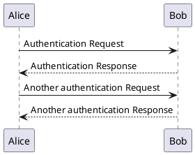

## PUML

### Inline PUML 



### SVG Local


### SVG Static


### SVG Page Resource


This is some wordy text
And so is this



### PNG resized



### SVG Figure





## Code highlighting

**YAML**
```yaml
---
root:
  someKey: "value"
```

**Bash**
```bash
echo "${VAR}"
```

**XML**
```xml
<root>
  <child attr="xxx">some val</child>
</root>
```

## Links

* [PUML](#inline-puml)

* [Code Highlighting](#code-highlighting)


## Table

Data Type       | Example UI String Forms                                               | Example YAML form
----------      | ----------------------                                                | ------------------
Boolean         | `true` `false`                                                        | `true` `false`
String          | `This is a string`                                                    | `"This is a string"`
Integer/Long    | `123`                                                                 | `123`
Float           | `1.23`                                                                | `1.23`
Stroom Duration | `P30D` `P1DT12H` `PT30S` `30d` `30s` `30000`                          | `"P30D"` `"P1DT12H"` `"PT30S"` `"30d"` `"30s"` `"30000"` See [Stroom Duration Data Type](#stroom-duration-data-type).
List            | `#red#Green#Blue` `,1,2,3`                                            | See [List Data Type](#list-data-type)
Map             | `,=red=FF0000,Green=00FF00,Blue=0000FF`                               | See [Map Data Type](#map-data-type)
DocRef          | `,docRef(MyType,a56ff805-b214-4674-a7a7-a8fac288be60,My DocRef name)` | See [DocRef Data Type](#docref-data-type)
Enum            | `HIGH` `LOW`                                                          | `"HIGH"` `"LOW"`
Path            | `/some/path/to/a/file`                                                | `"/some/path/to/a/file"`
ByteSize        | `32`, `512Kib`                                                        | `32`, `512Kib` See [Byte Size Data Type](#byte-size-data-type)

