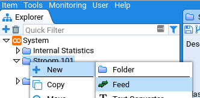

## Getting data into Stroom

### Create the feed

In real life you might configure Stroom to watch for new files in a directory. In this tutorial we'll be uploading data but the result will be the same: raw event data sitting on a feed.

A lot of Stroom's functionality is available through right-click context menus. If you right-click  _System_ in the tree you can create new things. Create a new folder and call it something like `Stroom 101`:

Right-click again and create a feed. The name needs to be capitalised, e.g. `CSV_IN`.

2. This will open a new tab for the feed. We want to add some data to the feed so click on _Data_ at the top of the tab. 

   

3. Then click the green up arrow () to get the file upload dialog.

4. We're going to be putting in unprocessed events, known in Stroom as _raw_ events. That's the type of stream this feed will contain, so that's the Stream Type you need to select. 

4. Download [this file](../resources/mock_stroom_data.csv), then click _choose file_ from the dialog, select the file, and then _ok_ everything until you're back at the feed.

That's it, there's now data in Stroom. You should be able to see it in the data table (you might need to click the refresh () button:

Now you can do all sorts of things with the data: transform it, visualise it, index it. It's [_Pipelines_](../process/process.md) that allow all these things to happen.
