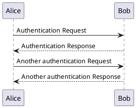

---
title: "Images"
linkTitle: "Images"
weight: 20
description: >
  Examples of how to include images in documents.
# Set draft: true to stop the page appearing in the published/released version.
tags:
  - style
exclude_search: true

---

## Image assets

All Images should be placed in `/assets/images/` or within a descendent directory of it.
Images should be added to the markdown using the `image` shortcode.
This ensures a consistent look for all images and allows control of the size of the image.

The short code can be added like this:

```markdown

```

All paths used in the `image` shortcode are relative to `/assets/images`.

The following shows an example of the directory structure.

```text

/assets
   /images
      /some_directory
         /example.svg
/content
   /en
      /docs
         /MyPage
            index.md - #image shortcode used in here
```


## Using page resources

Images can be located in a [page bundle (external link)](https://gohugo.io/content-management/page-bundles/).
This is where the page is defined as a named directory (rather than a `.md` file) with an associated `index.md` file for the markdown contnet.
All other items in the directory are page resources that can be used by the page, i.e. image files.

Whilst you can structure your site using page resources the preffered approach for stroom-docs is to use the common assets directory.
This keeps all the images in one place and means pages can have a named markdown file rather than all being called `index.md`.

Use the `image` short code to display an image file that is located in the same directory as the page.
For the short code to work the page must be a leaf bundle (`index.md`) or a branch bundle (`_index.md`), i.e:

```
/docs
   /MyPage
      index.md - #image shortcode used in here
      example.svg
```

or 

```
/docs
   /MySection
      /Page1
         index.md
      /Page2
         index.md
      _index.md - #image shortcode used in here
      example.svg
```

In the above example, the shortcode would look like:

```markdown

```




### Captions

The image can be displayed with a caption:


By W3C SVG Logo, CC BY-SA 4.0, https://commons.wikimedia.org/w/index.php?curid=105996438



### Size

The image can be defined with a maximum width (`nnnx`) or a maximum height (`xnnn`).




### .png files




## Using global `/assets/` resources

For images that are shared by multiple page bundles, e.g. stroom icons, place them in `/assets/images/`.
The image path is relative to `/assets/images/`, e.g. file  `/assets/images/style-guide/svg-example.svg` becomes:

```

```


This is some optional caption text for the image.
And this is another line.



## PlantUML

[PlantUML](https://plantuml.com) is the favoured tool for producing diagrams such as UML diagrams, entity relationship diagrams and other more general architecture diagrams.
The diagrams are written in plain text which makes them easy to version control.
The plantUML syntax can then be converted into image files, e.g. .svg files.

A plantUML diagram looks like this in plain text form:



PlantUML diagrams should be saved in a dedicated `.puml` file in the same folder as the page that will display it.
If it is needed by multiple pages then it should be saved in `/assets/images/`.

The build process will convert all `.puml` files to a corresponding `.puml.svg` file.
These generated `.puml.svg` files are ignored by git so need to be regenerated at build time or when you change a `.puml` file.
The images can be generated by doing:

```bash
./container_build/runInPumlDocker.sh SVG
```

You should embed an PlantUML image like this, using the `.puml.svg` file (that may not yet exist, but will have to exist before the site is built):




## Stroom icons

Stroom UI icons such as  or  can be added in line like this.
The first argument is the filename (and path) of the icon file.
The filename is relative to `/assets/images/stroom-ui/`.
The second argument is the hover tip title that will be given to the icon.
E.g:

```markdown
or  can be added in line like this.
```

Stroom pipeline elements can be added in line like this .
E.g:

```markdown
like this .
```

Stroom document elements can be added in line like this .
E.g:

```markdown
like this .
```

For a full list of all available icons see the [Icon Gallery]()
