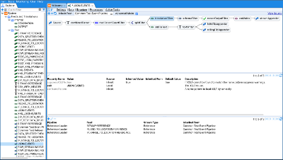
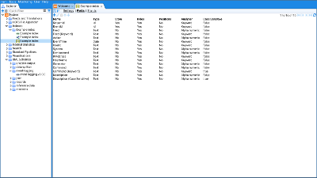

# Screenshots

Browse stored data

Create pipelines to transform data

Browse XML schemas used to validate data

Create custom indexes to search the data

Create custom visualisations for your data by directly editing script

Create dashboards that incorporate tables and other visualisations for your data

