# Quick-Start Indexing

Before you can visualise your data with dashboards you have to index the data;
First I opted for creating a specific volume to hold my data, just because I wanted to keep my shards away from the default volumes;

Go to the Tools ➔ Volumes menu


Once the volumes dialogue opens click the blue plus sign at the top left of the window to add a new one


Select the node where you want the volume to be and the path you want to create, (because we are following the quick-start guide we just have one node and limited size, but we do want it to active so we can write documents to it and we want it to be public, because we might want other indexes to use it; your needs might be different.
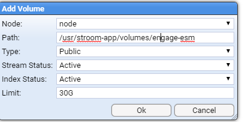

Click ok and we’re good to go.

Then we can create an index by selecting index item in the explorer tree. You do this in the same way you create any of the items. Just select/create a folder that you want to create the new index in and right click, select New Index.


Choose a name for your new index
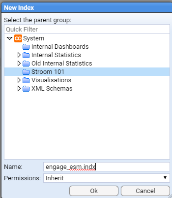

In the settings tab we need to specify the volume where we will store our shards

Now you need to add fields to this index.

Firstly there are two mandatory fields that need to be added: `StreamId` and `EventId`

Both should be of type Id, stored and indexed with the `Keyword` analyser
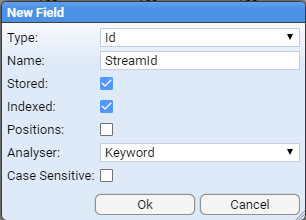

If you were following the quick-start instruction on ingesting the `mock_stroom_data.csv`, we’ll use those fields here.

Open the fields tab then create the following fields:

Name            |Type   |Store  |Index  |Positions  |Analyser       |Case Sensitive
----            |----   |-----  |-----  |---------  |--------       |--------------
StreamId        |Id     |Yes    |Yes    |No         |Keyword        |false
EventId         |Id     |Yes    |Yes    |No         |Keyword        |false
Id              |Text   |Yes    |Yes    |No         |Keyword        |false
Guid            |Text   |Yes    |Yes    |No         |Alpha numeric  |false
FromIp          |Text   |Yes    |Yes    |Yes        |Keyword        |false
ToIp            |Text   |Yes    |Yes    |Yes        |Keyword        |false
Application     |Text   |Yes    |Yes    |Yes        |Alpha numeric  |false

We are creating fields in our index to match the fields we have ingested to provide a place for the data to go that Stroom can reference.
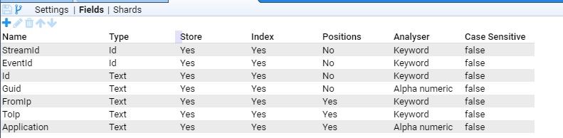

When you've done that, save the new index.

Now create a new XSLT (for the uninitiated like me) XSLT (Extensible Stylesheet Language Transformations). We are going to convert xml data into something indexable by Stroom.


To make things manageable we create our new XSLT with the same name as the index in the same folder. After you've set the name just save it and close it, we’ll add some code in there later.

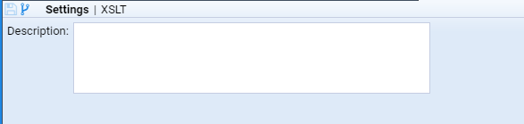

Now we get to send data to the index

Create a new pipeline called Indexing (we are going to make this a template for all future indexing requirements).


Edit the structure of the pipeline

Add the following element types with the specified names

Type                |Name
----                |----
XMLParser           |parser
RecordCountFilter   |readRecordCountFilter
SplitFilter         |splitFilter
IdEnrichmentFilter  |idEnrichmentFilter
XSLTFilter          |xsltFilter
RecordCountFilter   |writeRecordCountFilter
IndexingFilter      |indexingFilter

So it looks like this
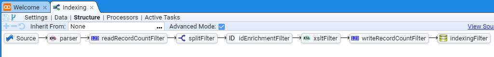

Once the elements have been added you need to set the following properties on the elements:

Element                 |Property   |Value
-------                 |--------   |-----
readRecordCountFilter   |countRead  |true
splitFilter             |splitCount |100
writeRecordCountFilter  |countRead  |false

To do this we select the element then double click the property value in the property panel which is below it.
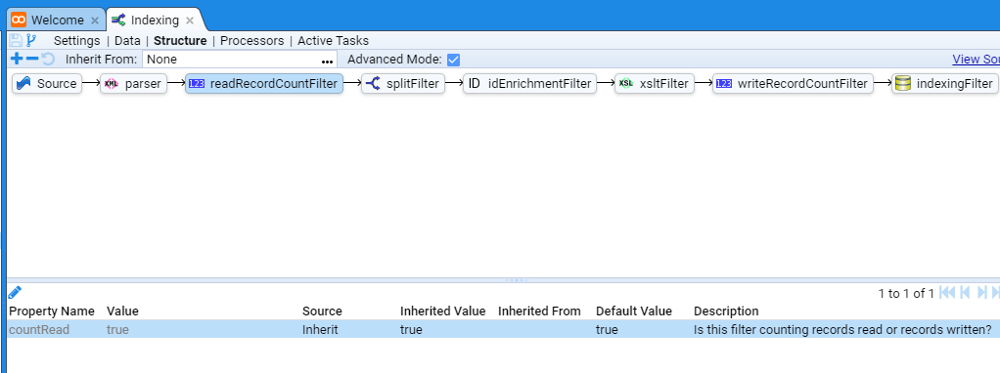

The dialogue pops up


Where you can set the values.

Save the pipeline, using the top left icon () close it the pipeline tab.

Now create a new pipeline


Which we will base on our new “Indexing” pipeline
On our structure tab
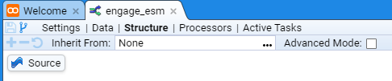

Click in the “Inherit From” window


Select our Indexing pipeline we just created


Now we need to set the XSLT property on the `xsltFilter` to point at the XSLT we created earlier and set the index on the `indexFilter` to point to the index we created.
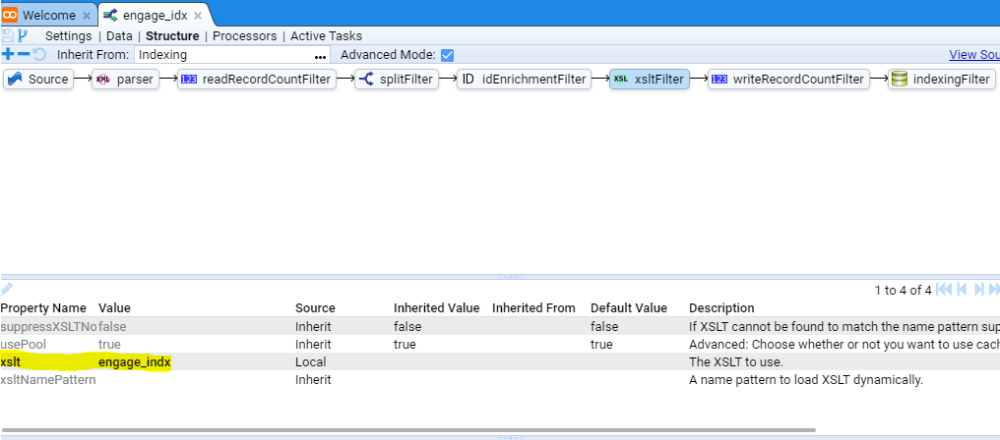

Once that's done you can save your new pipeline

Next we need to add XSLT to create XML that the `IndexingFilter` understands. Again all of this seems a little time consuming but once you've done this stuff and have some resources you can reuse it all gets much easier.

Open the feed we created in the quick-start guide if you find some processed data in your feed - i.e. browse the data
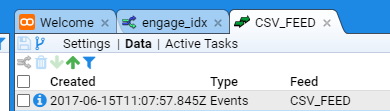

Click the stepping button


Select your new pipeline


Paste the following into your `xsltFilter`

```xml
<?xml version="1.0" encoding="UTF-8" ?>
<xsl:stylesheet
  xmlns="records:2" xmlns:stroom="stroom"
  xmlns:xsl="http://www.w3.org/1999/XSL/Transform" xmlns:xsi="http://www.w3.org/2001/XMLSchema-instance"
  version="2.0">
  <xsl:template match="/Events">
    <records xsi:schemaLocation="records:2 file://records-v2.0.xsd"
      version="2.0">
      <xsl:apply-templates />
    </records>
  </xsl:template>
  <xsl:template match="Event">
    <record>
      <data name="StreamId">
        <xsl:attribute name="value" select="@StreamId" />
      </data>
      <data name="EventId">
        <xsl:attribute name="value" select="@EventId" />
      </data>
      <xsl:apply-templates select="*" />
    </record>
  </xsl:template>
  <!-- Index the Id -->
  <xsl:template match="Id">
        <data name="Id">
          <xsl:attribute name="value" select="text()" />
        </data>
  </xsl:template>
  <!-- Index the Guid -->
  <xsl:template match="Guid">
    <data name="Guid">
      <xsl:attribute name="value" select="text()" />
    </data>
  </xsl:template>
  <!-- Index the FromIp -->
  <xsl:template match="FromIp">
    <data name="FromIp">
      <xsl:attribute name="value" select="text()" />
    </data>
  </xsl:template>
  <!-- Index the ToIp -->
  <xsl:template match="ToIp">
    <data name="ToIp">
      <xsl:attribute name="value" select="text()" />
    </data>
  </xsl:template>
  <!-- Index the Application -->
  <xsl:template match="Application">
    <data name="Application">
      <xsl:attribute name="value" select="text()" />
    </data>
  </xsl:template>
</xsl:stylesheet>
```

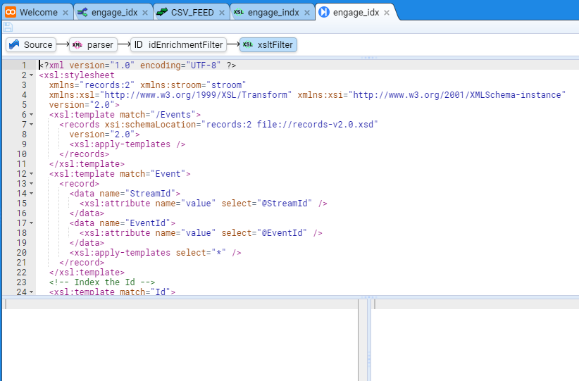

What we are trying to do is turn the data into Stroom `record` format. This is basically name value pairs that we pass to the index. Step through the data using the top right arrows to ensure the XSLT produces output.

We're nearly there for indexing the data - you just need to tell the pipeline to pick up all processed data and index it.

Go back to your pipeline and go to the processors tab.

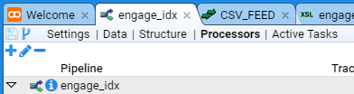

Add a filter using () and tell it to process all `Events` data when the filter dialogue opens so it looks like this

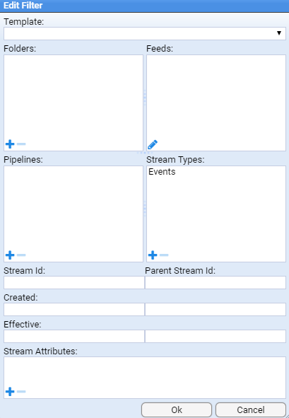

Enable the processor and the filter by clicking the enabled tick boxes

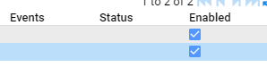

Stroom should then go away and index the data assuming everything is correct

If there are errors you'll see error streams produced in the data browsing page, i.e. where you see your processed and raw data

If it all goes to plan you'll see index shards appear if you open the index you created and click the shards tab.

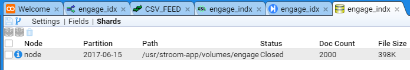

The document count doesn't update immediately so don't worry if the count is 0. The count is updated on shard flush and happens in the background.

Now that we have finished indexing we can display data on [dashboards](../dashboards/dashboards.md).