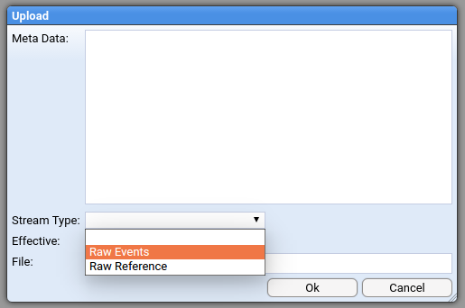
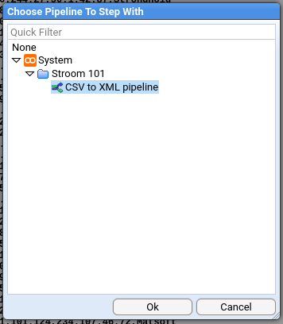
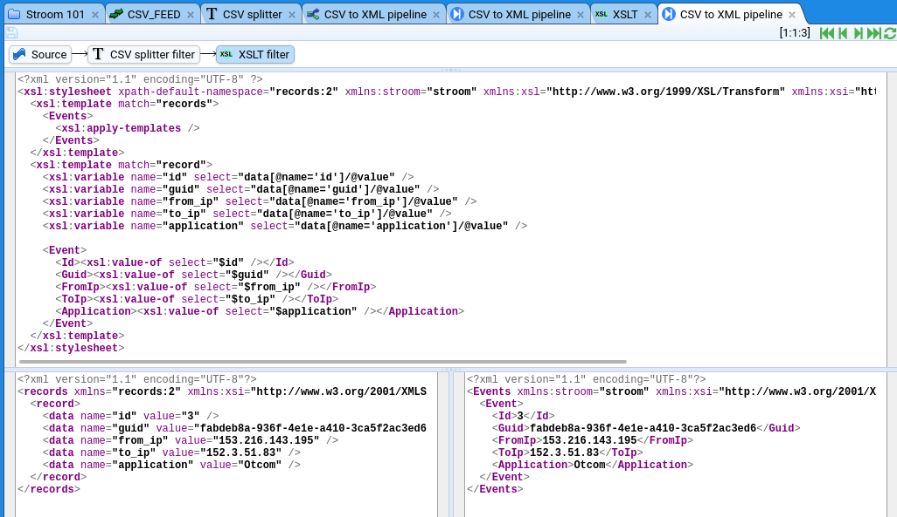
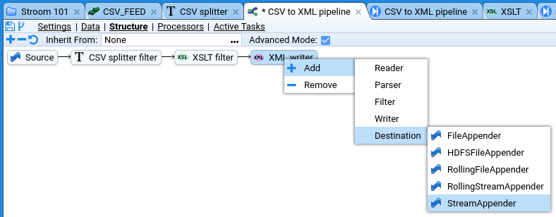
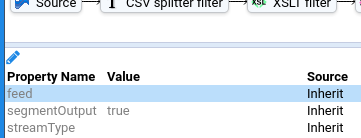

# Stroom Quick-Start Tutorial
In this quick-start guide you will learn how to use Stroom to get from [this CSV](./resources/mock_stroom_data.csv), which looks like this:

```
id,guid,from_ip,to_ip,application
1,10990cde-1084-4006-aaf3-7fe52b62ce06,159.161.108.105,217.151.32.69,Tres-Zap
2,633aa1a8-04ff-442d-ad9a-03ce9166a63a,210.14.34.58,133.136.48.23,Sub-Ex
...
```
To this XML:

```xml
<?xml version="1.1" encoding="UTF-8"?>
<Events xmlns:stroom="stroom" xmlns:xsi="http://www.w3.org/2001/XMLSchema-instance">
   <Event>
      <Id>1</Id>
      <Guid>10990cde-1084-4006-aaf3-7fe52b62ce06</Guid>
      <FromIp>159.161.108.105</FromIp>
      <ToIp>217.151.32.69</ToIp>
      <Application>Tres-Zap</Application>
   </Event>
   <Event>
      <Id>2</Id>
      <Guid>633aa1a8-04ff-442d-ad9a-03ce9166a63a</Guid>
      <FromIp>210.14.34.58</FromIp>
      <ToIp>133.136.48.23</ToIp>
      <Application>Sub-Ex</Application>
   </Event>
  ...
```

You will go from a clean vanilla Stroom to having a simple [pipeline](../user-guide/pipelines/README.md) that takes in CSV data and outputs that data transformed into XML. Stroom is a generic and powerful tool for ingesting and processing data: it's flexible because it's generic so if you do want to start processing data we would recommend you follow this tutorial otherwise you'll find yourself struggling.

We're going to do the following:

1. Get and run Stroom
2. Do some quick and easy but necessary config
3. Get some data into Stroom
4. Set up a pipeline

All the things we create here are available as a [content pack](https://github.com/gchq/stroom-content/releases/tag/stroom-101-v1.0), so if you just wanted to see it running you could get there quite easily.

> **Note:** The CSV data used in _mock_stroom_data.csv_ (linked to above) is randomly generated and any association with any real world IP address or name is entirely coincidental.

## Getting and Running Stroom

There are several options to get Stroom running and by far the quickest and easiest is to use Docker. If you're new to [Docker](https://www.docker.com/what-docker) then you might want to follow their [getting started guide](https://www.docker.com/products/docker) first. Otherwise you can follow our [quick guide](../dev-guide/docker-running.md).

If you're really interested here are your full options for running Stroom:

* [Run using a Docker Hub image (recommended)](../dev-guide/docker-running.md#using-a-pre-built-docker-hub-image)
* [Run using a release](../install-guide/stroom-app-install.md)
* From source you can:
  * [Build and run from IntelliJ](../dev-guide/stroom-in-an-ide.md)
  * [Build and run using Docker](../dev-guide/docker-building.md)

## Basic configuration

### Enable processing of data streams

Automatic processing isn't enabled by default: you might first want to check other settings (for example  nodes, properties, and volumes). So we need to enable Stream Processing. This is in Tools -> Jobs menu::


Next we need to enable Stream Processor jobs:


Below the list of jobs is the properties pane. The Stream Processor's properties show the list of nodes. You should have one. You'll need to enable it by scrolling right:


## Getting data into Stroom

### Create the feed

In real life you might configure Stroom to watch for new files in a directory. In this tutorial we'll be uploading data but the result will be the same: raw event data sitting on a feed.

A lot of Stroom's functionality is available through right-click context menus. If you right-click  _System_ in the tree you can create new things. Create a new folder and call it something like `Stroom 101`:


Right-click again and create a feed. The name needs to be capitalised, e.g. `CSV_IN`.


2. This will open a new tab for the feed. We want to add some data to the feed so click on _Data_ at the top of the tab. 

   

3. Then click the green up arrow () to get the file upload dialog.

4. We're going to be putting in unprocessed events, known in Stroom as _raw_ events. That's the type of stream this feed will contain, so that's the Stream Type you need to select. 



4. Download [this file](resources/mock_stroom_data.csv), then click _choose file_ from the dialog, select the file, and then _ok_ everything until you're back at the feed.

That's it, there's now data in Stroom. You should be able to see it in the data table (you might need to click the refresh (button):


Now you can do all sorts of things with the data: transform it, visualise it, index it. It's _Pipelines_ that allow all these things to happen.

## Create a pipeline

Pipelines control how data is processed in Stroom. Typically you're going to want to do a lot of the same stuff for every pipeline, i.e. similar transformations, indexing, writing out data. You can actually create a template pipeline and inherit from it, tweaking what you need to for this or that feed. We're not doing that now because we want to show how to create one from scratch.


1. Create a pipeline by right-clicking our `Stroom 101` folder. Call it something like `CSV to XML pipeline`.
2. Select _Structure_ from the top of the new tab. This is the most important view for the pipeline because it shows what will actually happen on the pipeline.
3. Check _Advanced Mode_ so that we can actually edit things.


We already have a `Source` element. Unlike most other pipeline elements this isn't something we need to configure. It's just there to show the starting point. Data gets into the pipeline via other means - we'll describe this in detail later.

### Add a data splitter

Data splitters are powerful, and [a lot we can say](../datasplitter/1-0-introduction.md) about them. Here we're just going to make a basic one.

#### Create a CSV splitter

We have CSV in the following form:
```
id,guid,from_ip,to_ip,application
1,10990cde-1084-4006-aaf3-7fe52b62ce06,159.161.108.105,217.151.32.69,Tres-Zap
2,633aa1a8-04ff-442d-ad9a-03ce9166a63a,210.14.34.58,133.136.48.23,Sub-Ex
```
To process this we need to know if there's a header row, and what the delimiters are. This is a job for a _Data Splitter_. 

The splitter is actually a type of _Text Converter_, so lets create one of those:


Call it something like `CSV splitter`. In the new tab you need to tell the _Text Converter_ that it'll be a _Data Splitter_:


Now go to the _Conversion_ tab. What you need to put in here is specific to the built-in _Data Splitter_ functionality, so I'm just going to tell you what you're going to need:

```xml
<?xml version="1.1" encoding="UTF-8"?>
<dataSplitter xmlns="data-splitter:3" xmlns:xsi="http://www.w3.org/2001/XMLSchema-instance" xsi:schemaLocation="data-splitter:3 file://data-splitter-v3.0.1.xsd" version="3.0">
  <!-- The first line contains the field names -->
  <split delimiter="\n" maxMatch="1">
    <group>
      <split delimiter="," containerStart="&#34;" containerEnd="&#34;">
        <var id="heading" />
      </split>
    </group>
  </split>

  <!-- All subsequent lines are records -->
  <split delimiter="\n">
    <group>
      <split delimiter="," containerStart="&#34;" containerEnd="&#34;">
        <data name="$heading$1" value="$1" />
      </split>
    </group>
  </split>
</dataSplitter>
```

You can see that it uses the `data-splitter-v3.0.1.xsd` that we imported earlier. Save it by clicking the save icon ().

So we now have a configured, re-usable data splitter for CSV files that have headers. We need to add this to our pipeline as a filter, so head back to the pipeline's Structure section and add a DSParser, as below. Call it something like `CSV splitter filter`:


Now we have a pipeline that looks like this:


Click on the `CSV splitter filter` element and the pane below will show it's properties. We need to tell it to use our newly created `CSV splitter`. Double click the `textConverter` property and change `Value` to the actual CSV splitter:


#### Test the csv splitter

So now we have CSV data in Stroom and a pipeline that is configured to process CSV data. We've done a fair few things so far and are we sure the pipeline is correctly configured? We can do some debugging and find out.

In Stroom you can step through you records and see what the output is at each stage. It's easy to start doing this. The first thing to do is to open your `CSV_FEED` feed, then click the big blue _stepping_ button at the bottom right:


You'll be asked to select a pipeline:



Now you get a view that's similar to your feed view, except it also shows the pipeline:


It also has stepping controls. Click the green step forward icon (). You should see something like this:


Great! If you don't see this then there's something wrong. Click on `CSV splitter filter`. You'll see the conversion code and hopefully some errors. Some issues might be: did you remember to import the data splitter schema into Stroom? Did you remember to confgure the _Text Converter_ to be a _Data Splitter_? 

If everything went fine then click the step forward button a few more times and you'll see the yellow selection move down as you process each row.

What we actually want to see is the output from the _Text Converter_, so click on `CSV splitter filter`. You'll see the conversion code we entered earlier and below two panes, one containing the CSV and one containing the split-up text, in XML form:


So here we have some XML in a basic format we call the _records_ format. You can see the schema for _records_ in the `XML schemas` folder.


### Add XSLT to transform records format XML into something else

#### Create the XSLT filter

This process is very similar to creating the `CSV splitter`: 

1. Create the [XSLT](../user-guide/pipelines/xslt/README.md) filter
2. Add it to the pipeline 
3. Step through to make sure it's doing what we expect


Create the XSLT filter, calling it something like `XSLT`:


On the new tab click on `XSLT`. This is another big text field but this one accepts XSLT. This one will be very basic and just takes the split up data and puts it into fields. The XSLT for this is below but if you'd like to tinker then go ahead.

```xml
<?xml version="1.1" encoding="UTF-8" ?>
<xsl:stylesheet xpath-default-namespace="records:2" xmlns:stroom="stroom" xmlns:xsl="http://www.w3.org/1999/XSL/Transform" xmlns:xsi="http://www.w3.org/2001/XMLSchema-instance" version="2.0">
  <xsl:template match="records">
    <Events>
      <xsl:apply-templates />
    </Events>
  </xsl:template>
  <xsl:template match="record">
    <xsl:variable name="id" select="data[@name='id']/@value" />
    <xsl:variable name="guid" select="data[@name='guid']/@value" />
    <xsl:variable name="from_ip" select="data[@name='from_ip']/@value" />
    <xsl:variable name="to_ip" select="data[@name='to_ip']/@value" />
    <xsl:variable name="application" select="data[@name='application']/@value" />

    <Event>
      <Id><xsl:value-of select="$id" /></Id>
      <Guid><xsl:value-of select="$guid" /></Guid>
      <FromIp><xsl:value-of select="$from_ip" /></FromIp>
      <ToIp><xsl:value-of select="$to_ip" /></ToIp>
      <Application><xsl:value-of select="$application" /></Application>
    </Event>
  </xsl:template>
</xsl:stylesheet>
```

Make sure you save it.

Go back to the Structure section of the pipeline and add an _XSLTFilter_ element. Call it something like `XSLT filter`. 


Select the `XSLT filter` and configure it to use the actual XSLT you just created by double-clicking `xslt` in the properties:


In the dialog make sure the value is the `XSLT` filter. Save the pipeline.

#### Test the XSLT filter

We're going to test this in the same way we tested the CSV splitter, by clicking the big blue button on the feed. Click the step forward button () a few times to make sure it's working then click on the XSLT element. This time you should see the XSLT filter there too, as well as the basic XML being transformed into more useful XML:



Fantastic! Data converted! Well done if you've got this far. Really, there are lots of steps and things that could go wrong and you've persevered. There's a few more things to get this pipeline ready for doing this [task](../user-guide/tasks.md) for real. We need to get this data to a destination.

### Outputting the transformed data

#### Create the XML writer

What's an XML Writer and why do you need one? The XSLT filter doesn't actually write XML but instead just passes XML events from one filter to another. In order to write XML out you need an XML writer. You don't need to create one outside the pipeline (in the way you did with the `CSV splitter` and the `XSLT` filter). An XML writer is just added to the pipeline like this:


That's it, no other configuration necessary.

#### Create the destination

We need to do something with the serialised XML. We'll write it to a stream. To do this we create a stream appender:




Unlike the `Source` element this element needs to be configured. We need to configure two things: the _streamType_ and the _destination feed_. 

##### Setting the feed

We'll send the output to the `CSV_FEED` - all data associated with this feed will be in the same place. To do that we edit the `feed` property and set it to `CSV_FEED`:



We also need to edit the `streamType` property:We set the streamType to Events:


That's it! Our pipeline is configured! 

#### Test the destination

We can test the XML writer and the streamAppender using the same stepping feature. Make sure you've saved the pipeline and set a **new** stepping session running. If you click on the `stream appender` you'll see something like this:


## Set the pipeline running

Obviously you don't want to step through your data one by one. This all needs automation, and this is what Processors are for. The processor works in the background to take any unprocessed data from a feed and put it through a pipeline. So far everything on our EXAMPLE_IN feed is unprocessed. 

### Create a processor

Processors are created from the _Processors_ section of the pipeline:


Click the add button  and configure the huge dialog. You only need to set the incoming feed and the stream types:

(

Now you'll see a very wide table looking something like this:


This shows two things:

* The processor for the pipeline
* The filter that determines what data is passed to the processor

If you scroll all the way over to the right you'll see the _Enabled_ checkbox:


Check _enabled_ for the processor and the filter you've just created. This is it, everything we've done is about to start working on its own, just like it would in a real configuration.

If you keep refreshing this table it will show you the processing status which should change after a few seconds to show that the data you have uploaded is being or has been processed. Once this has happened you should be able to open the destination feed and see the output data (or errors if there were any).


You can see that there are the `Raw Events` and the processed `Events`. If you click on the `Events` then you can see all the XML that we've produced.

#### Troubleshooting

If nothing happens you might need to enable stream processing. This was explained [earlier](quick-start.md#enable-processing-of-data-streams).

